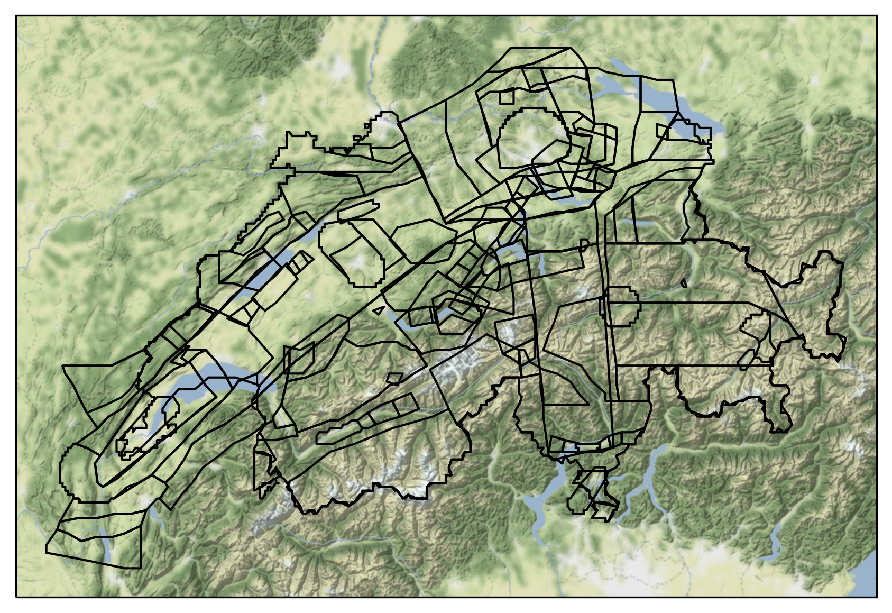

Importing Switzerland’s Airspaces
=================================

We import data on the Switzerland’s airspaces from
`OpenAIP <http://www.openaip.net/>`__ and convert it to OpenAir format
using one of the following tools: -
https://github.com/openAIP/airspace-converter -
https://github.com/alus-it/AirspaceConverter

We use this data to build a dataframe that can be used with the rest of
our code.

Latest data:
http://www.openaip.net/system/files/airspaces/openaip_airspace_switzerland_ch.aip_1600822879

Note that OpenAIP requires a (free) account to download files.

We use `python-openair <https://github.com/jsmailes/python-openair>`__
to process the OpenAir file, ensure this is installed and on your
PYTHONPATH.

Setup
-----

Modify the location below to point to the OpenAir file.

.. code:: ipython3

    openair_file = "/mnt/cold_data/josh/dumped/openaip_airspace_switzerland_ch.txt"

.. code:: ipython3

    import openair

.. code:: ipython3

    import requests
    from datetime import datetime, timezone
    import time
    import numpy as np
    import pandas as pd
    import descartes, geopandas
    import cartopy
    from shapely.geometry import LineString, Point, Polygon, MultiPolygon, base
    import pyproj
    from shapely.ops import transform, unary_union
    import math
    import matplotlib.pyplot as plt
    
    import cartopy.crs as ccrs
    import cartopy.geodesic as cgeo
    import cartopy.io.img_tiles as cimgt
    import cartopy.feature as cfeature
    
    import re

.. code:: ipython3

    heightstring = r"^(?P<fl>(FL|fl) ?(?P<fl_val>\d+))|(?P<msl>(?P<msl_val>\d+) ?(msl|MSL))|(?P<agl>(?P<agl_val>\d+) ?(agl|AGL))|(?P<fl_agl>(?P<fl_agl_val>\d+) ?(fl|FL) (agl|AGL))|(?P<m_agl>(?P<m_agl_val>\d+) ?(m|M) (agl|AGL))|(?P<gnd>gnd|GND)|(?P<f_msl>(?P<f_msl_val>\d+) ?(f|F) (msl|MSL))|(?P<f_gnd>(?P<f_gnd_val>\d+) ?(f|F) (gnd|GND))$"
    positionstring = r"^(?P<ns_d>\d{1,2}):(?P<ns_m>\d{1,2}):(?P<ns_s>\d{1,2}) ?(?P<ns>[NS]) ?(?P<ew_d>\d{1,3}):-?(?P<ew_m>\d{1,2}):(?P<ew_s>\d{1,2}) ?(?P<ew>[EW])$"
    
    expression_height = re.compile(heightstring)
    expression_position = re.compile(positionstring)

Initial Data Processing
-----------------------

The airspaces are loaded from the OpenAir file and turned into a
DataFrame with the help of a parsing library and a series of regular
expressions.

.. code:: ipython3

    airspaces = openair.parseFile(openair_file)

.. code:: ipython3

    df = pd.DataFrame(airspaces)
    
    df.columns = ['name', 'upper_limit_raw', 'lower_limit_raw', 'coords_raw']

.. code:: ipython3

    def metre_to_ft(x):
        return x * 3.28084
    
    def process_height(string):
        match = expression_height.match(string)
        if match is not None:
            if match.group('fl') is not None:
                return int(match.group('fl_val')) * 100
            elif match.group('msl') is not None:
                return int(match.group('msl_val'))
            elif match.group('agl') is not None:
                return int(match.group('agl_val'))
            elif match.group('fl_agl') is not None:
                return int(match.group('fl_agl_val')) * 100
            elif match.group('m_agl') is not None:
                return metre_to_ft(int(match.group('m_agl_val')))
            elif match.group('f_msl') is not None:
                return int(match.group('f_msl_val'))
            elif match.group('f_gnd') is not None:
                return int(match.group('f_gnd_val'))
            elif match.group('gnd') is not None:
                return 0
            else:
                raise Exception(string)
        else:
            raise Exception(string)

.. code:: ipython3

    def position_to_decimal(degrees, minutes, seconds, direction):
        return direction * (degrees + ((1/60) * minutes) + ((1/3600) * seconds))
    
    def process_position(string):
        match = expression_position.match(string)
        if match is not None:
            ns_deg = int(match.group('ns_d'))
            ns_min = int(match.group('ns_m'))
            ns_sec = int(match.group('ns_m'))
            ns_dir = 1 if match.group('ns') == "N" else -1
            latitude = position_to_decimal(ns_deg, ns_min, ns_sec, ns_dir)
            
            ew_deg = int(match.group('ew_d'))
            ew_min = int(match.group('ew_m'))
            ew_sec = int(match.group('ew_m'))
            ew_dir = 1 if match.group('ew') == "E" else -1
            longitude = position_to_decimal(ew_deg, ew_min, ew_sec, ew_dir)
            
            return [latitude, longitude] # TODO figure out if right way round
        else:
            raise Exception(string)
    
    def process_positions(positions):
        if isinstance(positions, list):
            return [ process_position(pos) for pos in positions ]
        else:
            return None
    
    def coords_to_points(coords):
        if coords is None:
            return geopandas.points_from_xy([], [])
        lats, longs = zip(*coords)
        return geopandas.points_from_xy(longs, lats)
    
    def geometry_lambda(positions):
        poly = Polygon(coords_to_points(process_positions(positions))).buffer(0)
        if isinstance(poly, Polygon):
            return MultiPolygon([poly])
        else:
            return MultiPolygon(poly)

.. code:: ipython3

    df['lower_limit'] = df.lower_limit_raw.apply(process_height)
    df['upper_limit'] = df.upper_limit_raw.apply(process_height)
    df['coords'] = df.coords_raw.apply(process_positions)
    df['geometry'] = df.coords_raw.apply(geometry_lambda)

.. code:: ipython3

    df

.. raw:: html

    

    
    <table border="1" class="dataframe">
      <thead>
        <tr style="text-align: right;">
          <th></th>
          <th>name</th>
          <th>upper_limit_raw</th>
          <th>lower_limit_raw</th>
          <th>coords_raw</th>
          <th>lower_limit</th>
          <th>upper_limit</th>
          <th>coords</th>
          <th>geometry</th>
        </tr>
      </thead>
      <tbody>
        <tr>
          <th>0</th>
          <td>A9.1 AIRWAY</td>
          <td>FL 195</td>
          <td>FL 90</td>
          <td>[47:15:18 N 008:58:21 E, 47:13:03 N 008:55:26 ...</td>
          <td>9000</td>
          <td>19500</td>
          <td>[[47.25416666666667, 8.982777777777779], [47.2...</td>
          <td>(POLYGON ((8.982777777777779 47.25416666666667...</td>
        </tr>
        <tr>
          <th>1</th>
          <td>A9.2 AIRWAY</td>
          <td>FL 195</td>
          <td>FL 130</td>
          <td>[47:02:49 N 008:56:49 E, 46:52:13 N 008:58:16 ...</td>
          <td>13000</td>
          <td>19500</td>
          <td>[[47.03388888888889, 8.94888888888889], [46.88...</td>
          <td>(POLYGON ((8.94888888888889 47.03388888888889,...</td>
        </tr>
        <tr>
          <th>2</th>
          <td>Aiguilles Rouges 300m AGL</td>
          <td>3300F GND</td>
          <td>GND</td>
          <td>[45:55:20 N 006:50:06 E, 45:55:21 N 006:49:49 ...</td>
          <td>0</td>
          <td>3300</td>
          <td>[[45.93194444444444, 6.847222222222222], [45.9...</td>
          <td>(POLYGON ((6.847222222222222 45.93194444444444...</td>
        </tr>
        <tr>
          <th>3</th>
          <td>Alpen Mil off</td>
          <td>FL 195</td>
          <td>FL 150</td>
          <td>[46:22:02 N 006:48:18 E, 46:31:43 N 007:03:52 ...</td>
          <td>15000</td>
          <td>19500</td>
          <td>[[46.37277777777778, 6.8133333333333335], [46....</td>
          <td>(POLYGON ((6.813333333333333 46.37277777777778...</td>
        </tr>
        <tr>
          <th>4</th>
          <td>Alpen Mil on</td>
          <td>FL 195</td>
          <td>FL 130</td>
          <td>[46:22:02 N 006:48:18 E, 46:31:43 N 007:03:52 ...</td>
          <td>13000</td>
          <td>19500</td>
          <td>[[46.37277777777778, 6.8133333333333335], [46....</td>
          <td>(POLYGON ((6.813333333333333 46.37277777777778...</td>
        </tr>
        <tr>
          <th>...</th>
          <td>...</td>
          <td>...</td>
          <td>...</td>
          <td>...</td>
          <td>...</td>
          <td>...</td>
          <td>...</td>
          <td>...</td>
        </tr>
        <tr>
          <th>147</th>
          <td>ZURICH 5 TMA 118.1</td>
          <td>FL 195</td>
          <td>3500F MSL</td>
          <td>[47:29:54 N 008:54:28 E, 47:26:19 N 008:53:32 ...</td>
          <td>3500</td>
          <td>19500</td>
          <td>[[47.49138888888889, 8.915000000000001], [47.4...</td>
          <td>(POLYGON ((8.915000000000001 47.49138888888889...</td>
        </tr>
        <tr>
          <th>148</th>
          <td>ZURICH 6 TMA 118.1</td>
          <td>FL 195</td>
          <td>5500F MSL</td>
          <td>[47:46:04 N 008:25:06 E, 47:43:28 N 008:18:17 ...</td>
          <td>5500</td>
          <td>19500</td>
          <td>[[47.779444444444444, 8.42361111111111], [47.7...</td>
          <td>(POLYGON ((8.423611111111111 47.77944444444444...</td>
        </tr>
        <tr>
          <th>149</th>
          <td>ZURICH 7 TMA 118.1</td>
          <td>FL 195</td>
          <td>7500F MSL</td>
          <td>[47:18:10 N 008:22:40 E, 47:13:56 N 008:25:55 ...</td>
          <td>7500</td>
          <td>19500</td>
          <td>[[47.305, 8.372777777777777], [47.220277777777...</td>
          <td>(POLYGON ((8.372777777777777 47.305, 8.4236111...</td>
        </tr>
        <tr>
          <th>150</th>
          <td>ZURICH 8 TMA 118.1</td>
          <td>FL 195</td>
          <td>6500F MSL</td>
          <td>[47:38:34 N 008:00:00 E, 47:34:34 N 007:59:59 ...</td>
          <td>6500</td>
          <td>19500</td>
          <td>[[47.64388888888889, 8.0], [47.57611111111112,...</td>
          <td>(POLYGON ((8 47.64388888888889, 7.999722222222...</td>
        </tr>
        <tr>
          <th>151</th>
          <td>ZURICH 9 TMA 118.1</td>
          <td>FL 195</td>
          <td>7500F MSL</td>
          <td>[47:51:45 N 008:46:30 E, 47:49:51 N 008:39:21 ...</td>
          <td>7500</td>
          <td>19500</td>
          <td>[[47.86416666666667, 8.779444444444444], [47.8...</td>
          <td>(POLYGON ((8.779444444444444 47.86416666666667...</td>
        </tr>
      </tbody>
    </table>
    
152 rows × 8 columns

    

.. code:: ipython3

    gdf = geopandas.GeoDataFrame(df, geometry=df.geometry)
    gdf.set_crs(epsg=4326, inplace=True)
    gdf.crs

.. parsed-literal::

    <Geographic 2D CRS: EPSG:4326>
    Name: WGS 84
    Axis Info [ellipsoidal]:
    - Lat[north]: Geodetic latitude (degree)
    - Lon[east]: Geodetic longitude (degree)
    Area of Use:
    - name: World
    - bounds: (-180.0, -90.0, 180.0, 90.0)
    Datum: World Geodetic System 1984
    - Ellipsoid: WGS 84
    - Prime Meridian: Greenwich

Visualising Airspaces
---------------------

We can now plot the airspaces on a map, and plot the airspaces which
intersect a given point.

.. code:: ipython3

    fig = plt.figure(dpi=300, figsize=(7,7))
    
    imagery = cimgt.Stamen(style="terrain-background")
    ax = plt.axes(projection=imagery.crs)
    
    minlon = 5.3
    maxlon = 10.7
    minlat = 45.5
    maxlat = 48
    
    ax.set_extent((minlon, maxlon, minlat, maxlat))
    ax.add_image(imagery, 8)
    
    ax.add_geometries(gdf.geometry, crs=ccrs.PlateCarree(), facecolor="none", edgecolor="black")
    
    ax.set_aspect('auto')
    
    plt.show()

.. code:: ipython3

    def filter_gdf(gdf, long, lat, height=None):
        loc = Point(long, lat)
        if height is not None:
            return gdf[(gdf.lower_limit < height) & (gdf.upper_limit > height) & gdf.geometry.contains(loc)]
        else:
            return gdf[gdf.geometry.contains(loc)]

.. code:: ipython3

    long = 8.567793
    lat = 47.351863
    gdf_filtered = filter_gdf(gdf, long, lat)
    
    
    fig = plt.figure(dpi=300, figsize=(7,7))
    
    imagery = cimgt.Stamen(style="terrain-background")
    ax = plt.axes(projection=imagery.crs)
    
    minlon = 5.3
    maxlon = 10.7
    minlat = 45.5
    maxlat = 48
    
    ax.set_extent((minlon, maxlon, minlat, maxlat))
    ax.add_image(imagery, 6)
    
    ax.add_geometries(gdf.geometry, crs=ccrs.PlateCarree(), facecolor="none", edgecolor="black")
    
    ax.add_geometries(gdf_filtered.geometry, crs=ccrs.PlateCarree(), facecolor="none", edgecolor="red")
    ax.scatter(long, lat, transform=ccrs.PlateCarree(), marker = "^", edgecolor="black", facecolor="white", s=100, zorder=10, label="Aircraft Location")
    
    ax.legend(loc="upper right").set_zorder(100)
    ax.set_aspect('auto')
    
    plt.show()

Export Data
-----------

We save the data to a file.

.. code:: ipython3

    from flight_processing import DataConfig

.. code:: ipython3

    config = DataConfig.known_dataset("switzerland")
    out_location = config.dataset_location
    out_location

.. parsed-literal::

    '/mnt/cold_data/josh/processing/regions_switzerland_wkt.json'

.. code:: ipython3

    gdf_out = gdf.drop(['upper_limit_raw', 'lower_limit_raw', 'coords_raw', 'coords'], axis=1).copy()
    gdf_out['wkt'] = gdf_out.geometry.apply(lambda g: g.wkt)
    
    gdf_out.to_file(out_location, driver="GeoJSON")
    
    del gdf_out
