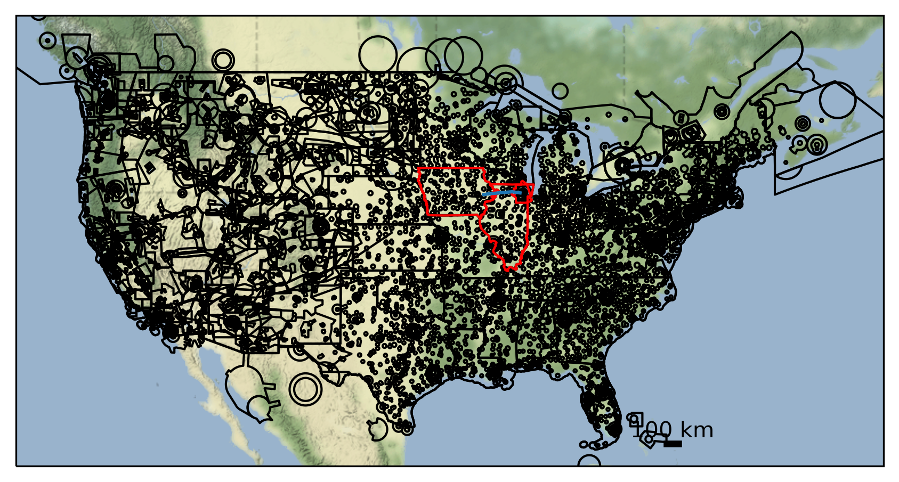

Processing Flights
==================

This notebook takes a dataset from a file or (Geo)DataFrame and flights
which have been dumped to a file (see ``demo-export-flights.ipynb``) and
procuces a graph of airspace handovers, saving the result to a file.

Ensure you have already dumped some flight data using the aforementioned
notebook, and set the data location in
``~/.config/flight_processing/flight_processing.conf``.

.. code:: ipython3

    from flight_processing import DataConfig
    from flight_processing.data import GraphBuilder, FlightDownloader
    
    import geopandas
    import logging
    
    logger = logging.getLogger()
    logger.setLevel(level=logging.INFO)
    
    logging.getLogger('traffic').disabled = True

Example 1: known dataset from file
----------------------------------

This example uses the already encoded bounds of Switzerland and its
airspace bounds which have already been saved to a file.

.. code:: ipython3

    # Initialise
    graphbuilder = GraphBuilder("switzerland")

.. parsed-literal::

    INFO:flight_processing.data.graph_builder:Loading airspace data from /mnt/cold_data/josh/processing/regions_switzerland_wkt.json.
    INFO:flight_processing.data.graph_builder:Initialising AirspaceHandler C++ object.
    INFO:flight_processing.data.graph_builder:Adding airspace data to AirspaceHandler C++ object.

.. code:: ipython3

    # Process one hour of flights
    graphbuilder.process_flights("2020-01-01 00:00")

.. parsed-literal::

    INFO:flight_processing.data.graph_builder:Processing downloaded flight data for time 2020-01-01 00:00:00.
    INFO:flight_processing.data.graph_builder:Calling AirspaceHandler C++ object to process file at /mnt/cold_data/josh/processing/flights/switzerland/20200101/0000.json.
    INFO:flight_processing.data.graph_builder:Retrieving result.
    INFO:flight_processing.data.graph_builder:Saving to file(s).
    INFO:flight_processing.data.data_utils:Converting graph to sparse matrix.
    INFO:flight_processing.data.data_utils:Saving graph as NPZ to /mnt/cold_data/josh/processing/graphs/switzerland/20200101/0000.npz.

.. code:: ipython3

    # Process 3 hours of flights
    graphbuilder.process_flights_bulk("2020-01-01 01:00", "2020-01-01 04:00")

.. parsed-literal::

    INFO:flight_processing.data.graph_builder:Processing downloaded flights in bulk between 2020-01-01 01:00:00 and 2020-01-01 04:00:00.
    INFO:flight_processing.utils:Executing function 3 times between 2020-01-01 01:00:00 and 2020-01-01 04:00:00 with time delta 1:00:00.
    INFO:flight_processing.data.graph_builder:Processing downloaded flight data for time 2020-01-01 01:00:00.
    INFO:flight_processing.data.graph_builder:Calling AirspaceHandler C++ object to process file at /mnt/cold_data/josh/processing/flights/switzerland/20200101/0100.json.
    INFO:flight_processing.data.graph_builder:Retrieving result.
    INFO:flight_processing.data.graph_builder:Saving to file(s).
    INFO:flight_processing.data.data_utils:Converting graph to sparse matrix.
    INFO:flight_processing.data.data_utils:Saving graph as NPZ to /mnt/cold_data/josh/processing/graphs/switzerland/20200101/0100.npz.
    INFO:flight_processing.data.graph_builder:Processing downloaded flight data for time 2020-01-01 02:00:00.
    INFO:flight_processing.data.graph_builder:Calling AirspaceHandler C++ object to process file at /mnt/cold_data/josh/processing/flights/switzerland/20200101/0200.json.
    INFO:flight_processing.data.graph_builder:Retrieving result.
    INFO:flight_processing.data.graph_builder:Saving to file(s).
    INFO:flight_processing.data.data_utils:Converting graph to sparse matrix.
    INFO:flight_processing.data.data_utils:Saving graph as NPZ to /mnt/cold_data/josh/processing/graphs/switzerland/20200101/0200.npz.
    INFO:flight_processing.data.graph_builder:Processing downloaded flight data for time 2020-01-01 03:00:00.
    INFO:flight_processing.data.graph_builder:Calling AirspaceHandler C++ object to process file at /mnt/cold_data/josh/processing/flights/switzerland/20200101/0300.json.
    INFO:flight_processing.data.graph_builder:Retrieving result.
    INFO:flight_processing.data.graph_builder:Saving to file(s).
    INFO:flight_processing.data.data_utils:Converting graph to sparse matrix.
    INFO:flight_processing.data.data_utils:Saving graph as NPZ to /mnt/cold_data/josh/processing/graphs/switzerland/20200101/0300.npz.

.. code:: ipython3

    # Cleanup
    del graphbuilder

Example 2: new dataset from (Geo)DataFrame
------------------------------------------

In this example we directly load a (Geo)DataFrame with the relevant
columns rather than relying on already saved files.

Note: in this case we are loading the same dataframe from a file, but
the dataframe can be produced within python without the need to save it
anywhere beforehand.

We are also using a custom DataConfig as in example 2 of
``demo-export-flights.ipynb``.

Note 2: GeoDataFrames require columns ``lower_limit``, ``upper_limit``,
``geometry``, and DataFrames require columns ``lower_limit``,
``upper_limit``, ``wkt``.

.. code:: ipython3

    dataset = DataConfig("switzerland-custom", minlon=5.3, maxlon=10.7, minlat=45.5, maxlat=48, detail=6)
    location = "/mnt/cold_data/josh/processing/regions_switzerland_wkt.json"

.. code:: ipython3

    gdf = geopandas.read_file(location)
    gdf

.. raw:: html

    

    
    <table border="1" class="dataframe">
      <thead>
        <tr style="text-align: right;">
          <th></th>
          <th>name</th>
          <th>lower_limit</th>
          <th>upper_limit</th>
          <th>wkt</th>
          <th>geometry</th>
        </tr>
      </thead>
      <tbody>
        <tr>
          <th>0</th>
          <td>A9.1 AIRWAY</td>
          <td>9000</td>
          <td>19500</td>
          <td>MULTIPOLYGON (((8.982777777777779 47.254166666...</td>
          <td>MULTIPOLYGON (((8.98278 47.25417, 8.93194 47.2...</td>
        </tr>
        <tr>
          <th>1</th>
          <td>A9.2 AIRWAY</td>
          <td>13000</td>
          <td>19500</td>
          <td>MULTIPOLYGON (((8.94888888888889 47.0338888888...</td>
          <td>MULTIPOLYGON (((8.94889 47.03389, 8.98278 46.8...</td>
        </tr>
        <tr>
          <th>2</th>
          <td>Aiguilles Rouges 300m AGL</td>
          <td>0</td>
          <td>3300</td>
          <td>MULTIPOLYGON (((6.847222222222222 45.931944444...</td>
          <td>MULTIPOLYGON (((6.84722 45.93194, 6.83028 45.9...</td>
        </tr>
        <tr>
          <th>3</th>
          <td>Alpen Mil off</td>
          <td>15000</td>
          <td>19500</td>
          <td>MULTIPOLYGON (((6.813333333333333 46.372777777...</td>
          <td>MULTIPOLYGON (((6.81333 46.37278, 7.05083 46.5...</td>
        </tr>
        <tr>
          <th>4</th>
          <td>Alpen Mil on</td>
          <td>13000</td>
          <td>19500</td>
          <td>MULTIPOLYGON (((6.813333333333333 46.372777777...</td>
          <td>MULTIPOLYGON (((6.81333 46.37278, 7.05083 46.5...</td>
        </tr>
        <tr>
          <th>...</th>
          <td>...</td>
          <td>...</td>
          <td>...</td>
          <td>...</td>
          <td>...</td>
        </tr>
        <tr>
          <th>147</th>
          <td>ZURICH 5 TMA 118.1</td>
          <td>3500</td>
          <td>19500</td>
          <td>MULTIPOLYGON (((8.915000000000001 47.491388888...</td>
          <td>MULTIPOLYGON (((8.91500 47.49139, 8.89806 47.4...</td>
        </tr>
        <tr>
          <th>148</th>
          <td>ZURICH 6 TMA 118.1</td>
          <td>5500</td>
          <td>19500</td>
          <td>MULTIPOLYGON (((8.423611111111111 47.779444444...</td>
          <td>MULTIPOLYGON (((8.42361 47.77944, 8.30500 47.7...</td>
        </tr>
        <tr>
          <th>149</th>
          <td>ZURICH 7 TMA 118.1</td>
          <td>7500</td>
          <td>19500</td>
          <td>MULTIPOLYGON (((8.372777777777777 47.305, 8.42...</td>
          <td>MULTIPOLYGON (((8.37278 47.30500, 8.42361 47.2...</td>
        </tr>
        <tr>
          <th>150</th>
          <td>ZURICH 8 TMA 118.1</td>
          <td>6500</td>
          <td>19500</td>
          <td>MULTIPOLYGON (((8 47.64388888888889, 7.9997222...</td>
          <td>MULTIPOLYGON (((8.00000 47.64389, 7.99972 47.5...</td>
        </tr>
        <tr>
          <th>151</th>
          <td>ZURICH 9 TMA 118.1</td>
          <td>7500</td>
          <td>19500</td>
          <td>MULTIPOLYGON (((8.779444444444444 47.864166666...</td>
          <td>MULTIPOLYGON (((8.77944 47.86417, 8.66083 47.8...</td>
        </tr>
      </tbody>
    </table>
    
152 rows × 5 columns

    

.. code:: ipython3

    graphbuilder = GraphBuilder.from_dataframe(dataset, gdf)

.. parsed-literal::

    INFO:flight_processing.data.graph_builder:Preprocessing dataframe.
    INFO:flight_processing.data.graph_builder:Saving dataframe to temporary file at /tmp/tmpo1fd5b_e.json.
    ERROR:fiona._env:/tmp/tmpo1fd5b_e.json: No such file or directory
    WARNING:fiona._env:driver GeoJSON does not support creation option ENCODING
    INFO:flight_processing.data.graph_builder:Instantiating GraphBuilder object.
    INFO:flight_processing.data.graph_builder:Loading airspace data from /tmp/tmpo1fd5b_e.json.
    INFO:flight_processing.data.graph_builder:Initialising AirspaceHandler C++ object.
    INFO:flight_processing.data.graph_builder:Adding airspace data to AirspaceHandler C++ object.
    INFO:flight_processing.data.graph_builder:Removing temporary file at /tmp/tmpo1fd5b_e.json.

.. code:: ipython3

    # Process one hour of flights
    graphbuilder.process_flights("2020-03-05 00:00")

.. parsed-literal::

    INFO:flight_processing.data.graph_builder:Processing downloaded flight data for time 2020-03-05 00:00:00.
    INFO:flight_processing.data.graph_builder:Calling AirspaceHandler C++ object to process file at /mnt/cold_data/josh/processing/flights/switzerland-custom/20200305/0000.json.
    INFO:flight_processing.data.graph_builder:Retrieving result.
    INFO:flight_processing.data.graph_builder:Saving to file(s).
    INFO:flight_processing.data.data_utils:Converting graph to sparse matrix.
    INFO:flight_processing.data.data_utils:Saving graph as NPZ to /mnt/cold_data/josh/processing/graphs/switzerland-custom/20200305/0000.npz.

.. code:: ipython3

    # Process 23 hours of flights
    graphbuilder.process_flights_bulk("2020-03-05 01:00", "2020-03-06 00:00")

.. parsed-literal::

    INFO:flight_processing.data.graph_builder:Processing downloaded flights in bulk between 2020-03-05 01:00:00 and 2020-03-06 00:00:00.
    INFO:flight_processing.utils:Executing function 23 times between 2020-03-05 01:00:00 and 2020-03-06 00:00:00 with time delta 1:00:00.
    INFO:flight_processing.data.graph_builder:Processing downloaded flight data for time 2020-03-05 01:00:00.
    INFO:flight_processing.data.graph_builder:Calling AirspaceHandler C++ object to process file at /mnt/cold_data/josh/processing/flights/switzerland-custom/20200305/0100.json.
    INFO:flight_processing.data.graph_builder:Retrieving result.
    INFO:flight_processing.data.graph_builder:Saving to file(s).
    INFO:flight_processing.data.data_utils:Converting graph to sparse matrix.
    INFO:flight_processing.data.data_utils:Saving graph as NPZ to /mnt/cold_data/josh/processing/graphs/switzerland-custom/20200305/0100.npz.
    INFO:flight_processing.data.graph_builder:Processing downloaded flight data for time 2020-03-05 02:00:00.
    INFO:flight_processing.data.graph_builder:Calling AirspaceHandler C++ object to process file at /mnt/cold_data/josh/processing/flights/switzerland-custom/20200305/0200.json.
    INFO:flight_processing.data.graph_builder:Retrieving result.
    INFO:flight_processing.data.graph_builder:Saving to file(s).
    INFO:flight_processing.data.data_utils:Converting graph to sparse matrix.
    INFO:flight_processing.data.data_utils:Saving graph as NPZ to /mnt/cold_data/josh/processing/graphs/switzerland-custom/20200305/0200.npz.
    INFO:flight_processing.data.graph_builder:Processing downloaded flight data for time 2020-03-05 03:00:00.
    INFO:flight_processing.data.graph_builder:Calling AirspaceHandler C++ object to process file at /mnt/cold_data/josh/processing/flights/switzerland-custom/20200305/0300.json.
    INFO:flight_processing.data.graph_builder:Retrieving result.
    INFO:flight_processing.data.graph_builder:Saving to file(s).
    INFO:flight_processing.data.data_utils:Converting graph to sparse matrix.
    INFO:flight_processing.data.data_utils:Saving graph as NPZ to /mnt/cold_data/josh/processing/graphs/switzerland-custom/20200305/0300.npz.
    INFO:flight_processing.data.graph_builder:Processing downloaded flight data for time 2020-03-05 04:00:00.
    INFO:flight_processing.data.graph_builder:Calling AirspaceHandler C++ object to process file at /mnt/cold_data/josh/processing/flights/switzerland-custom/20200305/0400.json.
    INFO:flight_processing.data.graph_builder:Retrieving result.
    INFO:flight_processing.data.graph_builder:Saving to file(s).
    INFO:flight_processing.data.data_utils:Converting graph to sparse matrix.
    INFO:flight_processing.data.data_utils:Saving graph as NPZ to /mnt/cold_data/josh/processing/graphs/switzerland-custom/20200305/0400.npz.
    INFO:flight_processing.data.graph_builder:Processing downloaded flight data for time 2020-03-05 05:00:00.
    INFO:flight_processing.data.graph_builder:Calling AirspaceHandler C++ object to process file at /mnt/cold_data/josh/processing/flights/switzerland-custom/20200305/0500.json.
    INFO:flight_processing.data.graph_builder:Retrieving result.
    INFO:flight_processing.data.graph_builder:Saving to file(s).
    INFO:flight_processing.data.data_utils:Converting graph to sparse matrix.
    INFO:flight_processing.data.data_utils:Saving graph as NPZ to /mnt/cold_data/josh/processing/graphs/switzerland-custom/20200305/0500.npz.
    INFO:flight_processing.data.graph_builder:Processing downloaded flight data for time 2020-03-05 06:00:00.
    INFO:flight_processing.data.graph_builder:Calling AirspaceHandler C++ object to process file at /mnt/cold_data/josh/processing/flights/switzerland-custom/20200305/0600.json.
    INFO:flight_processing.data.graph_builder:Retrieving result.
    INFO:flight_processing.data.graph_builder:Saving to file(s).
    INFO:flight_processing.data.data_utils:Converting graph to sparse matrix.
    INFO:flight_processing.data.data_utils:Saving graph as NPZ to /mnt/cold_data/josh/processing/graphs/switzerland-custom/20200305/0600.npz.
    INFO:flight_processing.data.graph_builder:Processing downloaded flight data for time 2020-03-05 07:00:00.
    INFO:flight_processing.data.graph_builder:Calling AirspaceHandler C++ object to process file at /mnt/cold_data/josh/processing/flights/switzerland-custom/20200305/0700.json.
    INFO:flight_processing.data.graph_builder:Retrieving result.
    INFO:flight_processing.data.graph_builder:Saving to file(s).
    INFO:flight_processing.data.data_utils:Converting graph to sparse matrix.
    INFO:flight_processing.data.data_utils:Saving graph as NPZ to /mnt/cold_data/josh/processing/graphs/switzerland-custom/20200305/0700.npz.
    INFO:flight_processing.data.graph_builder:Processing downloaded flight data for time 2020-03-05 08:00:00.
    INFO:flight_processing.data.graph_builder:Calling AirspaceHandler C++ object to process file at /mnt/cold_data/josh/processing/flights/switzerland-custom/20200305/0800.json.
    INFO:flight_processing.data.graph_builder:Retrieving result.
    INFO:flight_processing.data.graph_builder:Saving to file(s).
    INFO:flight_processing.data.data_utils:Converting graph to sparse matrix.
    INFO:flight_processing.data.data_utils:Saving graph as NPZ to /mnt/cold_data/josh/processing/graphs/switzerland-custom/20200305/0800.npz.
    INFO:flight_processing.data.graph_builder:Processing downloaded flight data for time 2020-03-05 09:00:00.
    INFO:flight_processing.data.graph_builder:Calling AirspaceHandler C++ object to process file at /mnt/cold_data/josh/processing/flights/switzerland-custom/20200305/0900.json.
    INFO:flight_processing.data.graph_builder:Retrieving result.
    INFO:flight_processing.data.graph_builder:Saving to file(s).
    INFO:flight_processing.data.data_utils:Converting graph to sparse matrix.
    INFO:flight_processing.data.data_utils:Saving graph as NPZ to /mnt/cold_data/josh/processing/graphs/switzerland-custom/20200305/0900.npz.
    INFO:flight_processing.data.graph_builder:Processing downloaded flight data for time 2020-03-05 10:00:00.
    INFO:flight_processing.data.graph_builder:Calling AirspaceHandler C++ object to process file at /mnt/cold_data/josh/processing/flights/switzerland-custom/20200305/1000.json.
    INFO:flight_processing.data.graph_builder:Retrieving result.
    INFO:flight_processing.data.graph_builder:Saving to file(s).
    INFO:flight_processing.data.data_utils:Converting graph to sparse matrix.
    INFO:flight_processing.data.data_utils:Saving graph as NPZ to /mnt/cold_data/josh/processing/graphs/switzerland-custom/20200305/1000.npz.
    INFO:flight_processing.data.graph_builder:Processing downloaded flight data for time 2020-03-05 11:00:00.
    INFO:flight_processing.data.graph_builder:Calling AirspaceHandler C++ object to process file at /mnt/cold_data/josh/processing/flights/switzerland-custom/20200305/1100.json.
    INFO:flight_processing.data.graph_builder:Retrieving result.
    INFO:flight_processing.data.graph_builder:Saving to file(s).
    INFO:flight_processing.data.data_utils:Converting graph to sparse matrix.
    INFO:flight_processing.data.data_utils:Saving graph as NPZ to /mnt/cold_data/josh/processing/graphs/switzerland-custom/20200305/1100.npz.
    INFO:flight_processing.data.graph_builder:Processing downloaded flight data for time 2020-03-05 12:00:00.
    INFO:flight_processing.data.graph_builder:Calling AirspaceHandler C++ object to process file at /mnt/cold_data/josh/processing/flights/switzerland-custom/20200305/1200.json.
    INFO:flight_processing.data.graph_builder:Retrieving result.
    INFO:flight_processing.data.graph_builder:Saving to file(s).
    INFO:flight_processing.data.data_utils:Converting graph to sparse matrix.
    INFO:flight_processing.data.data_utils:Saving graph as NPZ to /mnt/cold_data/josh/processing/graphs/switzerland-custom/20200305/1200.npz.
    INFO:flight_processing.data.graph_builder:Processing downloaded flight data for time 2020-03-05 13:00:00.
    INFO:flight_processing.data.graph_builder:Calling AirspaceHandler C++ object to process file at /mnt/cold_data/josh/processing/flights/switzerland-custom/20200305/1300.json.
    INFO:flight_processing.data.graph_builder:Retrieving result.
    INFO:flight_processing.data.graph_builder:Saving to file(s).
    INFO:flight_processing.data.data_utils:Converting graph to sparse matrix.
    INFO:flight_processing.data.data_utils:Saving graph as NPZ to /mnt/cold_data/josh/processing/graphs/switzerland-custom/20200305/1300.npz.
    INFO:flight_processing.data.graph_builder:Processing downloaded flight data for time 2020-03-05 14:00:00.
    INFO:flight_processing.data.graph_builder:Calling AirspaceHandler C++ object to process file at /mnt/cold_data/josh/processing/flights/switzerland-custom/20200305/1400.json.
    INFO:flight_processing.data.graph_builder:Retrieving result.
    INFO:flight_processing.data.graph_builder:Saving to file(s).
    INFO:flight_processing.data.data_utils:Converting graph to sparse matrix.
    INFO:flight_processing.data.data_utils:Saving graph as NPZ to /mnt/cold_data/josh/processing/graphs/switzerland-custom/20200305/1400.npz.
    INFO:flight_processing.data.graph_builder:Processing downloaded flight data for time 2020-03-05 15:00:00.
    INFO:flight_processing.data.graph_builder:Calling AirspaceHandler C++ object to process file at /mnt/cold_data/josh/processing/flights/switzerland-custom/20200305/1500.json.
    INFO:flight_processing.data.graph_builder:Retrieving result.
    INFO:flight_processing.data.graph_builder:Saving to file(s).
    INFO:flight_processing.data.data_utils:Converting graph to sparse matrix.
    INFO:flight_processing.data.data_utils:Saving graph as NPZ to /mnt/cold_data/josh/processing/graphs/switzerland-custom/20200305/1500.npz.
    INFO:flight_processing.data.graph_builder:Processing downloaded flight data for time 2020-03-05 16:00:00.
    INFO:flight_processing.data.graph_builder:Calling AirspaceHandler C++ object to process file at /mnt/cold_data/josh/processing/flights/switzerland-custom/20200305/1600.json.
    INFO:flight_processing.data.graph_builder:Retrieving result.
    INFO:flight_processing.data.graph_builder:Saving to file(s).
    INFO:flight_processing.data.data_utils:Converting graph to sparse matrix.
    INFO:flight_processing.data.data_utils:Saving graph as NPZ to /mnt/cold_data/josh/processing/graphs/switzerland-custom/20200305/1600.npz.
    INFO:flight_processing.data.graph_builder:Processing downloaded flight data for time 2020-03-05 17:00:00.
    INFO:flight_processing.data.graph_builder:Calling AirspaceHandler C++ object to process file at /mnt/cold_data/josh/processing/flights/switzerland-custom/20200305/1700.json.
    INFO:flight_processing.data.graph_builder:Retrieving result.
    INFO:flight_processing.data.graph_builder:Saving to file(s).
    INFO:flight_processing.data.data_utils:Converting graph to sparse matrix.
    INFO:flight_processing.data.data_utils:Saving graph as NPZ to /mnt/cold_data/josh/processing/graphs/switzerland-custom/20200305/1700.npz.
    INFO:flight_processing.data.graph_builder:Processing downloaded flight data for time 2020-03-05 18:00:00.
    INFO:flight_processing.data.graph_builder:Calling AirspaceHandler C++ object to process file at /mnt/cold_data/josh/processing/flights/switzerland-custom/20200305/1800.json.
    INFO:flight_processing.data.graph_builder:Retrieving result.
    INFO:flight_processing.data.graph_builder:Saving to file(s).
    INFO:flight_processing.data.data_utils:Converting graph to sparse matrix.
    INFO:flight_processing.data.data_utils:Saving graph as NPZ to /mnt/cold_data/josh/processing/graphs/switzerland-custom/20200305/1800.npz.
    INFO:flight_processing.data.graph_builder:Processing downloaded flight data for time 2020-03-05 19:00:00.
    INFO:flight_processing.data.graph_builder:Calling AirspaceHandler C++ object to process file at /mnt/cold_data/josh/processing/flights/switzerland-custom/20200305/1900.json.
    INFO:flight_processing.data.graph_builder:Retrieving result.
    INFO:flight_processing.data.graph_builder:Saving to file(s).
    INFO:flight_processing.data.data_utils:Converting graph to sparse matrix.
    INFO:flight_processing.data.data_utils:Saving graph as NPZ to /mnt/cold_data/josh/processing/graphs/switzerland-custom/20200305/1900.npz.
    INFO:flight_processing.data.graph_builder:Processing downloaded flight data for time 2020-03-05 20:00:00.
    INFO:flight_processing.data.graph_builder:Calling AirspaceHandler C++ object to process file at /mnt/cold_data/josh/processing/flights/switzerland-custom/20200305/2000.json.
    INFO:flight_processing.data.graph_builder:Retrieving result.
    INFO:flight_processing.data.graph_builder:Saving to file(s).
    INFO:flight_processing.data.data_utils:Converting graph to sparse matrix.
    INFO:flight_processing.data.data_utils:Saving graph as NPZ to /mnt/cold_data/josh/processing/graphs/switzerland-custom/20200305/2000.npz.
    INFO:flight_processing.data.graph_builder:Processing downloaded flight data for time 2020-03-05 21:00:00.
    INFO:flight_processing.data.graph_builder:Calling AirspaceHandler C++ object to process file at /mnt/cold_data/josh/processing/flights/switzerland-custom/20200305/2100.json.
    INFO:flight_processing.data.graph_builder:Retrieving result.
    INFO:flight_processing.data.graph_builder:Saving to file(s).
    INFO:flight_processing.data.data_utils:Converting graph to sparse matrix.
    INFO:flight_processing.data.data_utils:Saving graph as NPZ to /mnt/cold_data/josh/processing/graphs/switzerland-custom/20200305/2100.npz.
    INFO:flight_processing.data.graph_builder:Processing downloaded flight data for time 2020-03-05 22:00:00.
    INFO:flight_processing.data.graph_builder:Calling AirspaceHandler C++ object to process file at /mnt/cold_data/josh/processing/flights/switzerland-custom/20200305/2200.json.
    INFO:flight_processing.data.graph_builder:Retrieving result.
    INFO:flight_processing.data.graph_builder:Saving to file(s).
    INFO:flight_processing.data.data_utils:Converting graph to sparse matrix.
    INFO:flight_processing.data.data_utils:Saving graph as NPZ to /mnt/cold_data/josh/processing/graphs/switzerland-custom/20200305/2200.npz.
    INFO:flight_processing.data.graph_builder:Processing downloaded flight data for time 2020-03-05 23:00:00.
    INFO:flight_processing.data.graph_builder:Calling AirspaceHandler C++ object to process file at /mnt/cold_data/josh/processing/flights/switzerland-custom/20200305/2300.json.
    INFO:flight_processing.data.graph_builder:Retrieving result.
    INFO:flight_processing.data.graph_builder:Saving to file(s).
    INFO:flight_processing.data.data_utils:Converting graph to sparse matrix.
    INFO:flight_processing.data.data_utils:Saving graph as NPZ to /mnt/cold_data/josh/processing/graphs/switzerland-custom/20200305/2300.npz.

.. code:: ipython3

    # Cleanup
    del graphbuilder

Example 3: Process a single flight, plot on map
-----------------------------------------------

In this example we load up the dataset as described above, but we
download a single flight using ``traffic`` and process just that flight.
We plot this flight, the dataframe, and the airspaces it passes through
on a map to verify that the processing works correctly.

We will use the USA dataset here because we have access to more flight
data, but this should work for any region.

.. code:: ipython3

    # Initialise
    graphbuilder = GraphBuilder("usa")
    downloader = FlightDownloader("usa")

.. parsed-literal::

    INFO:flight_processing.data.graph_builder:Loading airspace data from /mnt/cold_data/josh/processing/regions_usa_wkt.json.
    INFO:flight_processing.data.graph_builder:Initialising AirspaceHandler C++ object.
    INFO:flight_processing.data.graph_builder:Adding airspace data to AirspaceHandler C++ object.

.. code:: ipython3

    # Download some flights
    flights = downloader.download_flights("2020-01-01 00:00", "2020-01-01 01:00", limit=2000)
    flights

.. parsed-literal::

    INFO:flight_processing.data.flight_downloader:Downloading flights between 2020-01-01 00:00:00 and 2020-01-01 01:00:00 from OpenSky.
    INFO:root:Sending request between time 2020-01-01 00:00:00+00:00 and 2020-01-01 01:00:00+00:00 and hour 2020-01-01 00:00:00+00:00 and 2020-01-01 01:00:00+00:00
    INFO:paramiko.transport:Connected (version 2.0, client OpenSSH_7.6p1)
    INFO:paramiko.transport:Authentication (password) successful!
    INFO:root:Sending request: select time, icao24, lat, lon, velocity, heading, vertrate, callsign, onground, alert, spi, squawk, baroaltitude, geoaltitude, lastposupdate, lastcontact, hour from state_vectors_data4  where hour>=1577836800.0 and hour<1577840400.0 and time>=1577836800.0 and time<1577840400.0 and lon>=-130 and lon<=-58 and lat>=23 and lat<=46 limit 2000
    INFO:root:Reading request in cache /mnt/cold_data/josh/traffic_cache/opensky/21dfcfe680bd06298dd2706f96bcf45f
    INFO:numexpr.utils:Note: NumExpr detected 32 cores but "NUMEXPR_MAX_THREADS" not set, so enforcing safe limit of 8.
    INFO:numexpr.utils:NumExpr defaulting to 8 threads.

.. raw:: html

    <b>Traffic with 2 identifiers</b><table id="T_0efa1bb2_01a9_11eb_a43e_63a6d0713514" ><thead>    <tr>        <th class="blank" ></th>        <th class="blank level0" ></th>        <th class="col_heading level0 col0" >count</th>    </tr>    <tr>        <th class="index_name level0" >icao24</th>        <th class="index_name level1" >callsign</th>        <th class="blank" ></th>    </tr></thead><tbody>
                    <tr>
                            <th id="T_0efa1bb2_01a9_11eb_a43e_63a6d0713514level0_row0" class="row_heading level0 row0" >a63e46</th>
                            <th id="T_0efa1bb2_01a9_11eb_a43e_63a6d0713514level1_row0" class="row_heading level1 row0" >GJS4571</th>
                            <td id="T_0efa1bb2_01a9_11eb_a43e_63a6d0713514row0_col0" class="data row0 col0" >1572</td>
                </tr>
                <tr>
                            <th id="T_0efa1bb2_01a9_11eb_a43e_63a6d0713514level0_row1" class="row_heading level0 row1" >a90aaa</th>
                            <th id="T_0efa1bb2_01a9_11eb_a43e_63a6d0713514level1_row1" class="row_heading level1 row1" >PDT4960</th>
                            <td id="T_0efa1bb2_01a9_11eb_a43e_63a6d0713514row1_col0" class="data row1 col0" >428</td>
                </tr>
        </tbody></table>

.. code:: ipython3

    # Isolate one specific flight
    flight = flights[0]
    flight

.. parsed-literal::

    INFO:root:Loading @junzis aircraft database

.. raw:: html

    <b>Flight GJS4571</b><ul><li><b>aircraft:</b> a63e46</li><li><b>from:</b> 2020-01-01 00:33:48+00:00</li><li><b>to:</b> 2020-01-01 00:59:59+00:00</li></ul>
<svg xmlns="http://www.w3.org/2000/svg" xmlns:xlink="http://www.w3.org/1999/xlink" width="300" height="300" viewBox="-135423.21082497007 -18336.099103533877 270647.7932102147 38013.44865558917" preserveAspectRatio="xMinYMin meet"><g transform="matrix(1,0,0,-1,0,1341.2504485214158)"><polyline fill="none" stroke="#66cc99" stroke-width="1804.3186214014313" points="125200.59004412555,3173.8589706889215 122867.5919198346,3509.2466815237703 112939.69356218372,4768.247356313995 74761.88464283258,9460.099381405695 73269.10198732886,9589.314650877608 71702.76748027669,9652.427815086083 70271.10104570804,9653.35721093623 68620.3013518612,9594.537473586182 66167.99526011178,9421.283879278157 50182.83867556489,8064.196283514865 -26578.169687905804,1357.0910438521921 -73458.20927524341,-2787.3649047844096 -100352.90465817228,-5087.41291462081 -101343.83900808413,-5200.480239360804 -102247.35170722942,-5355.347522738554 -105469.23979599755,-6050.691959607349 -110337.32310109501,-7172.146234168171 -112414.92903940687,-7596.918445827148 -114555.50712264286,-7949.226962956602 -116715.61255923496,-8214.127289332971 -117683.11362858533,-8285.148742611062 -118860.816967042,-8312.106762414815 -125399.21848385101,-8091.751316263284" opacity="0.8" /></g></svg>

.. code:: ipython3

    handovers = graphbuilder.process_single_flight(flights[0])
    len(handovers)

.. parsed-literal::

    INFO:flight_processing.data.graph_builder:Converting flight to arrays of coordinates.
    INFO:flight_processing.data.graph_builder:Processing flight using AirspaceHandler C++ object.

.. parsed-literal::

    8

.. code:: ipython3

    regions = set()
    for u,v in handovers:
        regions.add(u)
        regions.add(v)
    
    len(regions)

.. parsed-literal::

    7

.. code:: ipython3

    graphbuilder.draw_map(flight=flights[0], subset=regions)

.. parsed-literal::

    INFO:flight_processing.data.graph_builder:Downloading terrain data from Stamen.
    INFO:flight_processing.data.graph_builder:Plotting airspace boundaries on map.
    INFO:flight_processing.data.graph_builder:Plotting flight(s) on map.
    INFO:flight_processing.data.graph_builder:Plotting subset of airspaces on map.

.. code:: ipython3

    # Cleanup
    del graphbuilder
    del downloader
    del flights
